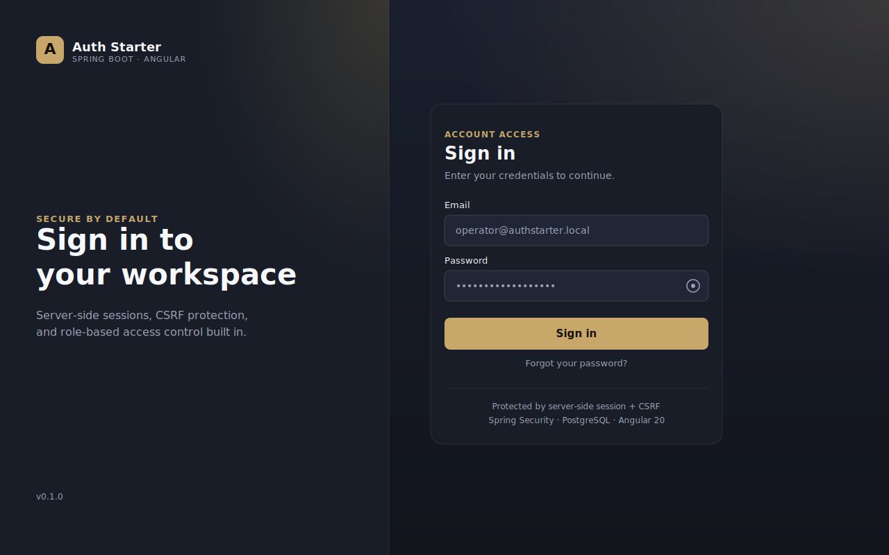
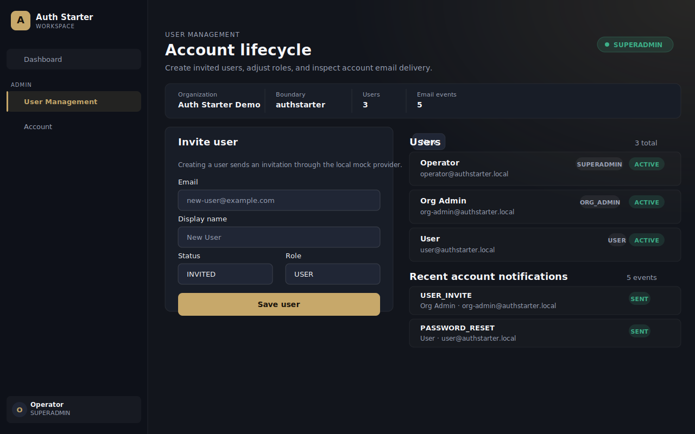
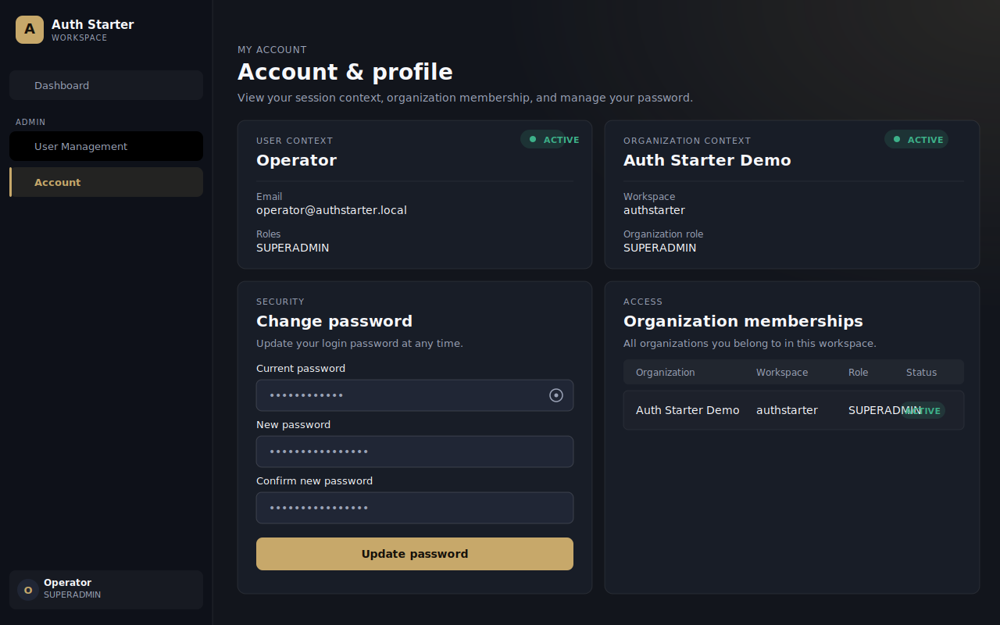

[English](./README.md) | [简体中文](./README.zh-CN.md) | [Français](./README.fr.md)

# Spring Boot Angular Auth Starter

[](https://github.com/woodyhua/springboot-angular-auth-starter/actions/workflows/backend.yml)
[](https://github.com/woodyhua/springboot-angular-auth-starter/actions/workflows/frontend.yml)
[](./LICENSE)

Reusable open-source starter for a Spring Boot authentication backend and Angular authentication frontend. It uses server-side sessions, CSRF protection, PostgreSQL persistence, GraphQL, and role-based access control as the default full-stack integration model.

This English README is the source of truth for the repository documentation. Translations should be updated from this file.

## Screenshots

| Login | Admin — User Management | Account &amp; Profile |
|---|---|---|
|  |  |  |

## Purpose

This project provides a practical baseline for authentication, authorization, user lifecycle management, invitations, password setup and reset, and account notification history. It is intended as a starter, not a complete deployed identity platform.

## Features

- Spring Boot backend with Spring Security, Spring GraphQL, JDBC, Flyway, and PostgreSQL
- Angular frontend with login, logout, session bootstrap, route guards, account page, user management, and notification history
- Server-side session authentication with the `AUTH_STARTER_SESSION` cookie
- CSRF bootstrap at `GET /auth/csrf` and `X-XSRF-TOKEN` headers for unsafe requests
- RBAC roles: `SUPERADMIN`, `ORG_ADMIN`, `USER`
- Current user, organization context, workspace, and membership queries
- Admin user creation and updates for `SUPERADMIN` and current-organization `ORG_ADMIN`
- Invitation flow and first-login password setup with hashed single-use tokens
- Forgot password and password reset flows with hashed tokens
- Notification event history with `local-mock` or `smtp` email providers
- Local Docker Compose setup for PostgreSQL and the backend

## Tech Stack

- Backend: Java 21, Spring Boot 3.5.14, Spring Security, Spring GraphQL, JDBC, Flyway
- Database: PostgreSQL 16 in local Docker Compose
- Frontend: Angular 20.2, Apollo Angular, RxJS, lucide-angular
- Tooling: Gradle wrapper, Node 22.14.0, pnpm 10.6.5, Docker Compose

## Project Layout

- [backend](./backend/README.md): Spring Boot application, GraphQL schema, security configuration, Flyway migrations, and tests
- [frontend](./frontend/README.md): Angular application, auth flows, route guards, GraphQL client, runtime config, and tests
- [docker-compose.yml](./docker-compose.yml): local-only PostgreSQL and backend services bound to `127.0.0.1`
- [.env.example](./.env.example): safe reference environment variables
- [.env.local.example](./.env.local.example): local-only demo credentials and developer settings
- [Makefile](./Makefile): verification shortcuts for backend and frontend checks
- [docs/en](./docs/en/README.md): canonical detailed documentation
- [docs/zh-CN](./docs/zh-CN/README.md): Simplified Chinese documentation
- [docs/fr](./docs/fr/README.md): French documentation

## Local Setup

Start PostgreSQL and the backend with Docker Compose:

```sh
docker compose up --build
```

The backend runs at `http://localhost:8080`. Docker Compose binds backend and PostgreSQL ports to `127.0.0.1` and is intended only for local development. Compose explicitly sets `SPRING_PROFILES_ACTIVE=local` for demo credentials; the backend Docker image itself does not default to the local profile. Use [.env.example](./.env.example) for safe defaults and [.env.local.example](./.env.local.example) only for local demo credentials.

Run the frontend separately:

```sh
cd frontend
npx -y pnpm@10.6.5 install --frozen-lockfile
npx -y pnpm@10.6.5 start
```

Open `http://localhost:4200`.

Backend without Docker:

```sh
cd backend
./gradlew bootRun --args='--spring.profiles.active=local'
```

This expects PostgreSQL at `jdbc:postgresql://localhost:5432/authstarter` unless `AUTH_STARTER_DATASOURCE_URL` and related variables are set.

## Default Local Users

These are local-only demo credentials from the `local`/`dev` profiles and Docker Compose. Do not use them in deployed environments.

Baseline local login:

- `operator@authstarter.local`
- `authstarter-local-password`
- `SUPERADMIN`

Additional local users in [application-local.yml](./backend/src/main/resources/application-local.yml):

- `org-admin@authstarter.local` / `authstarter-local-password` / `ORG_ADMIN`
- `user@authstarter.local` / `authstarter-local-password` / `USER`

Break-glass authentication is disabled by default in [application.yml](./backend/src/main/resources/application.yml). The local profile and Docker Compose explicitly enable it only for local demo use.


## API Documentation

The backend includes OpenAPI/Swagger documentation for REST support endpoints and uses the GraphQL schema as the contract for authentication, RBAC, user-management, invitation, password-reset, and notification operations.

Start the backend locally, then open:

- Swagger UI: `http://localhost:8080/swagger-ui.html`
- OpenAPI JSON: `http://localhost:8080/v3/api-docs`
- OpenAPI YAML: `http://localhost:8080/v3/api-docs.yaml`
- GraphQL endpoint: `http://localhost:8080/graphql`

Typical browser clients first fetch `GET /auth/csrf`, then call `POST /graphql` with the `X-XSRF-TOKEN` header and the `AUTH_STARTER_SESSION` cookie. See [API documentation](./docs/en/api-documentation.md) and [schema.graphqls](./backend/src/main/resources/graphql/schema.graphqls) for operation examples.

## API Overview

GraphQL endpoint:

- `POST /graphql`

Public GraphQL operations:

- `readiness`
- `currentSession`
- `login`
- `logout`
- `acceptUserInvite`
- `requestPasswordReset`
- `resetPassword`

Authenticated operations:

- `currentUserProfile`
- `currentOrganizationContext`
- `foundationOrganizations`
- `rbacBaseline`
- `notificationEvents`
- `changeOwnPassword`

Admin operations requiring `SUPERADMIN` or current-organization `ORG_ADMIN`:

- `adminManagementBaseline`
- `adminCreateUser`
- `adminUpdateUser`

Other backend endpoints:

- `GET /auth/csrf`
- `GET /actuator/health`
- `GET /actuator/health/liveness`
- `GET /actuator/health/readiness`

See [schema.graphqls](./backend/src/main/resources/graphql/schema.graphqls) for the current schema.

## Environment Variables

Important backend variables:

- `AUTH_STARTER_DATASOURCE_URL`
- `AUTH_STARTER_DATASOURCE_USERNAME`
- `AUTH_STARTER_DATASOURCE_PASSWORD`
- `AUTH_STARTER_FRONTEND_ORIGIN`
- `AUTH_STARTER_SESSION_COOKIE_SECURE`
- `AUTH_STARTER_SESSION_COOKIE_SAME_SITE`
- `AUTH_STARTER_BASELINE_AUTH_USERNAME`
- `AUTH_STARTER_BASELINE_AUTH_PASSWORD`
- `AUTH_STARTER_BASELINE_AUTH_DISPLAY_NAME`
- `AUTH_STARTER_BASELINE_AUTH_ROLE`
- `AUTH_STARTER_BASELINE_AUTH_BREAK_GLASS_ENABLED`
- `AUTH_STARTER_GRAPHQL_MAX_QUERY_DEPTH`
- `AUTH_STARTER_GRAPHQL_MAX_QUERY_COMPLEXITY`
- `AUTH_STARTER_GRAPHQL_MAX_REQUEST_BYTES`
- `AUTH_STARTER_GRAPHQL_INTROSPECTION_ENABLED`
- `AUTH_STARTER_NOTIFICATION_EMAIL_PROVIDER`
- `AUTH_STARTER_SMTP_HOST`
- `AUTH_STARTER_SMTP_PORT`

Use `AUTH_STARTER_NOTIFICATION_EMAIL_PROVIDER=local-mock` for local development without a mail server. Use `smtp` with the SMTP variables in [.env.example](./.env.example) for a local mail catcher or SMTP service.

Public auth mutations have a basic in-memory rate limiter. For production or multi-instance deployments, replace or back it with distributed storage such as Redis.

GraphiQL is disabled by default. GraphQL introspection is disabled by default through `AUTH_STARTER_GRAPHQL_INTROSPECTION_ENABLED=false`; local/dev configuration enables it for developer use.

The frontend development environment points to:

- `backendBaseUrl`: `http://localhost:8080`
- `graphql.endpoint`: `http://localhost:8080/graphql`

See [environment.ts](./frontend/src/environments/environment.ts) and [config.template.json](./frontend/public/config.template.json).

## Verification

Direct commands:

```sh
cd backend && ./gradlew test
cd backend && ./gradlew bootJar
cd frontend && npx -y pnpm@10.6.5 lint
cd frontend && npx -y pnpm@10.6.5 test
cd frontend && npx -y pnpm@10.6.5 build
```

Or run grouped checks from the repository root:

```sh
make verify
```

Root package scripts are also available through pnpm:

```sh
npx -y pnpm@10.6.5 run backend:test
npx -y pnpm@10.6.5 run frontend:lint
```

## Documentation

- [Getting started](./docs/en/getting-started.md)
- [Architecture](./docs/en/architecture.md)
- [Authentication](./docs/en/authentication.md)
- [Deployment](./docs/en/deployment.md)
- [Troubleshooting](./docs/en/troubleshooting.md)
- [Documentation maintenance](./docs/documentation-maintenance.md)

## Non-Goals

- This repository does not include a documentation framework such as VitePress or Docusaurus.
- The local Docker Compose file is a development setup, not production infrastructure.
- The backend Docker image starts with safe base defaults unless `SPRING_PROFILES_ACTIVE` is explicitly provided.
- The starter does not include application-specific business workflows.
- The starter does not currently include a separate frontend container image.

## Roadmap

Planned improvements (contributions welcome):

- Frontend container image and a single-command full-stack Compose setup
- OAuth2 / OpenID Connect login support
- Refresh token or sliding session support
- Frontend end-to-end tests (Playwright or Cypress)
- Helm chart or example Kubernetes manifests
- Rate limiting backed by Redis for multi-instance deployments
- Email provider plugins beyond SMTP (SendGrid, Mailgun)

Open an issue to discuss a contribution before starting significant work.

## Support

See [SUPPORT.md](./SUPPORT.md) for how to ask questions, report bugs, and request features.

## License

Apache-2.0. See [LICENSE](./LICENSE).
